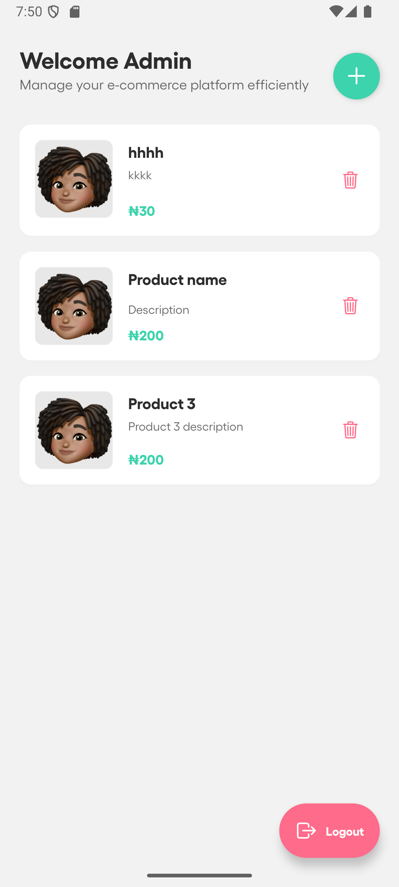
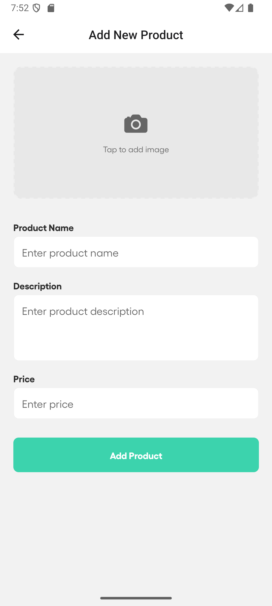
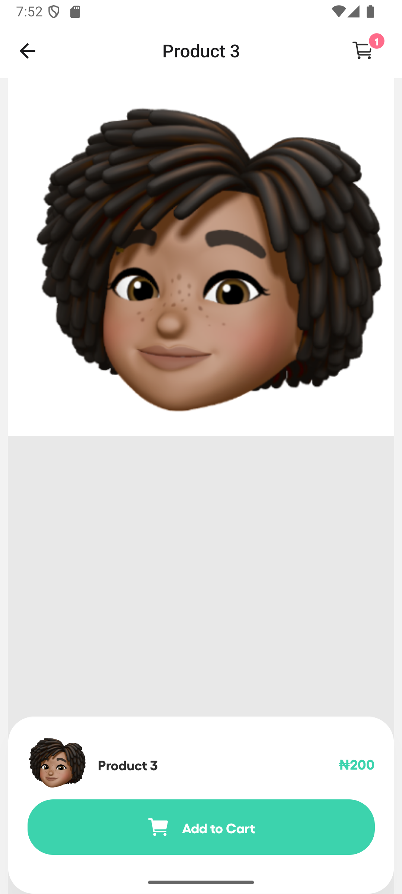
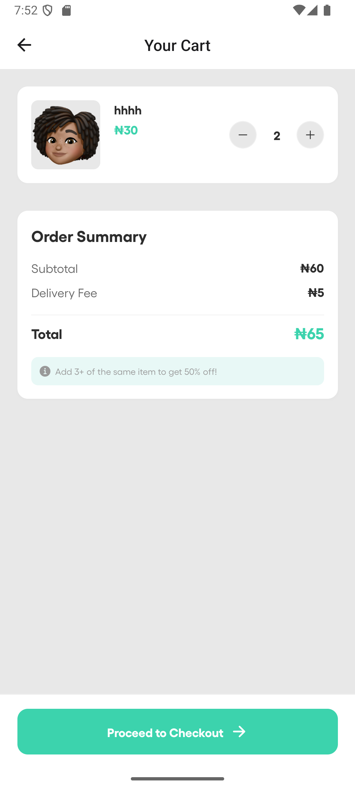

# E-Commerce Mobile App

A full-featured e-commerce mobile application built with React Native and Expo, featuring user authentication, product browsing, shopping cart, and admin dashboard.

## Features

- 🛍️ Browse and search products
- 🛒 Shopping cart functionality
- 👤 User authentication and profiles
- 📱 Admin dashboard for product management
- 💳 Product details and variants
- 📦 Order management

## Screenshots

<p align="center">
  
  
  
</p>

<p align="center">
  
  
</p>

## Setup Instructions

### Prerequisites

- Node.js (v16 or higher)
- npm or yarn
- For iOS: macOS with Xcode installed
- For Android: Android Studio installed

### Installation

1. Clone the repository:
   ```sh
   git clone <your-repo-url>
   cd <project-folder>
   ```

2. Install dependencies:
   ```sh
   npm install
   ```

### Running the App

**Important:** This app uses native packages and **cannot be run with Expo Go**. You must use a development build.

#### Option 1: Run on iOS Simulator (macOS only)

```sh
npm run ios
```

This will build and launch the app in the iOS Simulator.

#### Option 2: Run on Android Emulator/Device

```sh
npm run android
```

This will build and launch the app on a connected Android device or running emulator via Android Studio.

#### Option 3: Install APK on Android Device

1. Build the development APK:
   ```sh
   eas build --profile development --platform android
   ```

2. Once the build completes, download the APK file from the Expo dashboard.

3. Transfer the APK to your Android device and install it.

4. Start the development server:
   ```sh
   npm start
   ```

5. Open the app on your device and connect to the development server.

## Why Expo Go Won't Work

This project uses native packages and modules that require custom native code. Expo Go only supports a limited set of packages from the Expo SDK. To run this app, you must use a development build which includes all the necessary native dependencies.

## Development Build

This project uses [Expo Development Builds](https://docs.expo.dev/develop/development-builds/introduction/) which provide a customizable runtime environment for your app, allowing you to include any native code your app needs while still maintaining the fast development workflow of Expo.

## Tech Stack

- React Native
- Expo
- TypeScript
- React Navigation
- Expo Development Build

## Resources

- [Expo Documentation](https://docs.expo.dev/)
- [React Native Documentation](https://reactnative.dev/)
- [EAS Build Documentation](https://docs.expo.dev/build/introduction/)

---

For support or questions, please open an issue in the repository.